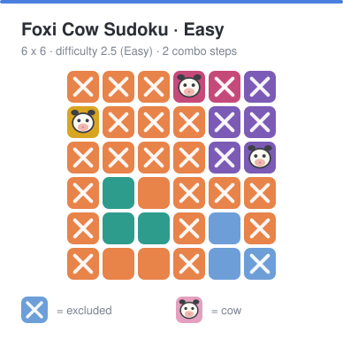
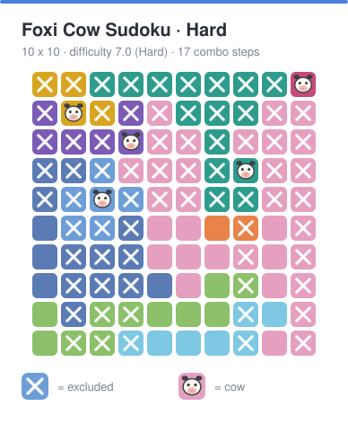
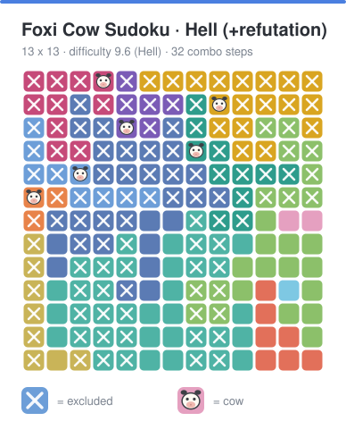

# 佛系消消消 · 纯净版

**在线试玩（推荐）：<https://lsqkk.github.io/foxi-cow-sudoku/>** —— 打开即玩，无需安装，纯静态站点。

《佛系消消消》的纯前端复刻版（数独 + 扫雷玩法）：**没有体力值、没有广告、没有内购，提示不限次数**。
关卡在浏览器里即时生成，每关都保证 **唯一解** 且 **纯逻辑可解**，难度从入门到地狱可调，可以无限玩下去。

* 玩法原型：桌面上的两张游戏截图（10×10、第 1567 关）。
* 三条规则：①每种颜色只有 1 头小牛；②每行每列有且仅有 1 头；③小牛不能相邻（含斜角）。

## 演示

下面是引擎**实时生成**的真实关卡（玩到一半的盘面：白 × 是排除，🐮 是小牛）：

| 入门 6×6 | 困难 10×10 | 地狱 13×13（含反证） |
| --- | --- | --- |
|  |  |  |

上图就是引擎生成的关卡，点开链接就是**同一张地图**（这些都是「自定义」模式里的关卡码）：

| 难度 | 关卡码 | 在线打开 |
| --- | --- | --- |
| 入门 6×6（2.5） | `FOXI1-6-p-c29hu` | <https://lsqkk.github.io/foxi-cow-sudoku/?m=custom&code=FOXI1-6-p-c29hu> |
| 困难 10×10（7.0） | `FOXI1-a-1y-c29hu` | <https://lsqkk.github.io/foxi-cow-sudoku/?m=custom&code=FOXI1-a-1y-c29hu> |
| 地狱 13×13（9.6，含反证） | `FOXI1-d-2o-c29hu` | <https://lsqkk.github.io/foxi-cow-sudoku/?m=custom&code=FOXI1-d-2o-c29hu> |

也可以打开「自定义」模式自己调难度（1~10）和棋盘（5~13），或用「粘贴关卡码」导入别人分享的**关卡码 / 链接**。

## 快速开始

```bash
npm install
npm run dev      # http://localhost:5173
npm run build    # 产出静态站点到 dist/
npm run preview  # 预览打包结果
npm test         # 引擎测试（唯一性 / 推理可靠性 / 关卡与模式 / 星级与记录）
```

部署是纯静态的：`dist/` 可以直接放到 GitHub Pages、Vercel、Netlify 或任意静态空间，不需要后端。
仓库里已经带了两个 GitHub Actions：

* `.github/workflows/deploy.yml`：推到 `main`/`master` 后自动 类型检查 → 测试 → 构建 → **发布到 GitHub Pages**；
* `.github/workflows/ci.yml`：其他分支 / PR 上跑同样的检查。

> 首次使用时，到仓库 **Settings → Pages → Build and deployment → Source** 选 **GitHub Actions** 即可。
> 站点地址形如 `https://lsqkk.github.io/<仓库名>/`（构建用相对路径，放在子目录也能正常打开）。

## 玩法与模式

| 模式 | 说明 |
| --- | --- |
| 🏆 经典闯关 | 一关关往下走，难度缓慢爬升（1.8 → 9.6），进度自动保存，可回到任意已解锁关卡重刷星级 |
| 📅 每日挑战 | 按日期固定种子，每天一张全球同图，可分享关卡码 |
| ⏱ 限时挑战 | 连续 5 关计时赛，完成后**立即自动结算并保存**：结算面板显示总用时与每关分段，成绩页保留最近 5 次记录与历史最佳 |
| 🍃 禅模式 | 没有计时压力，随时调难度（1~10）和棋盘尺寸（5~13） |
| 🎛 自定义 | 用滑杆指定难度（1~10）与尺寸（5~13）出题，或用关卡码导入别人分享的地图 |

打开网站首先看到的是**首页**（继续闯关进度、每日挑战、模式入口、战绩摘要），不会直接开局。
**计时从你第一次点击棋盘才开始**，所以看题、思考要多久都不吃亏。

首页顶部会提醒你：**规则、操作说明和每种推理方法的图示都在顶栏的「规则玩法」里**。
对局进行中随时可以切到别的页面（例如去看规则）——本局不会丢，回首页点「继续对局 / 对局进行中」就能接着玩，
离开时会自动暂停计时。

### 从任意关开始：解锁挑战

关卡列表里已解锁的关卡可以直接玩；想直接跳到后面的关卡（比如第 30 关）需要通过一次**解锁挑战**：

* **限时**：按关卡难度与棋盘尺寸算出（60 秒 ~ 10 分钟）；
* **错误上限**：1~3 次（难的关卡给得多）；
* 超时或用完错误次数即挑战失败，不会解锁；通过后该关及之前所有关卡解锁。

关卡列表可以一直往后翻页（手机上也支持左右滑动翻页），也可以用「跳到第 N 关」直接输入关号；
点已解锁的关卡会直接开始，点未解锁的才会弹挑战。

从分享链接进入时**直接打开那张地图，不再弹“解锁挑战”**（链接是别人给你的，就不必再卡一次解锁）。
解锁挑战只在你从关卡列表主动往后跳关时出现。

操作与原版一致：

* 单击空格 → 打 ×；单击 × → 取消；按住拖动 → 连续打 ×／连续取消；
* 双击格子 → 放小牛，**放上就固定了，不能再取消**（错了用撤销 / 清除）；
* 双击了**错误的位置** → 直接变成一个固定的**红色 ×**，也是固定的，方便记住这条错路；
* 放下一头牛后，默认会把它所在的**行、列、同色区域以及周围 8 格**自动打上 ×；
  这个「放下自动排除」可以在对局面板的按钮或设置里**关掉**，改成纯手动打 ×。

> 「放错立刻提示」在设置里可以关掉：关掉后错误的牛会留在盘上、照样自动排除，需要你自己发现矛盾，
> 更接近“纯推理”的玩法。

提示会**从最简单的推理开始**：只要有“某行 / 列 / 颜色只剩一个候选”这类一眼可见的步骤，就先讲这个，
再一步步升级到包含关系、邻域覆盖、反证等高级技巧；提示里提到的每块颜色都会完整框出来，不会只框住其中几格。

其它：撤销、计时、错误/提示统计、色盲友好（花纹 + 字母）、深色模式、音效开关、暂停、关卡码分享。
每关按“错误 / 提示次数”评 1~3 星，成绩与进度都存在浏览器本地，不上传任何数据。

关卡列表默认停在**你当前正在挑战的那一关**所在页，当前关会高亮。
「粘贴关卡码」既认纯关卡码（`FOXI1-…`），也认完整的分享链接 / 网址。

### 分享链接（URL 参数）

进入任意关卡后地址栏会自动带上参数，点“分享”按钮即可一键复制；打开链接就能拿到**完全相同的那张地图**：

| 参数 | 含义 |
| --- | --- |
| `code` | 关卡码（尺寸 + 难度 + 种子），保证地图一致，任何模式都带 |
| `m` | 模式：`classic` / `daily` / `timeattack` / `zen` / `custom` |
| `lv` | 经典/限时模式的关卡号 |
| `day` | 每日挑战的日期（`YYYY-MM-DD`） |
| `n` / `d` / `seed` | 自定义模式的尺寸 / 难度 / 种子（通常用 `code` 代替） |

例如 `?m=classic&lv=30&code=FOXI1-9-a-1y4y1`、`?code=FOXI1-a-6-1y4y1`。

界面图标全部使用 **Font Awesome**（SVG，可 tree-shake、离线可用），只有小牛保留 emoji；
移动端做了专门适配：底部工具栏改成图标网格、棋盘按视口高度自适应、标签栏可横向滑动、支持安全区。
移动端**不会为了省地方把说明文字藏掉**：规则栏会改成竖排、完整显示每一条规则。

「规则玩法」页里除了规则和操作，还列出了 7 种常用推理方法，每种都配了一张小示意图（颜色块 + 蓝框 + ×/牛）。
「关于」里给出了开源地址：<https://github.com/lsqkk/foxi-cow-sudoku>。

## 难度是怎么定义的

难度分（1~10）只看**关卡设计**，棋盘大小只做 ±10% 的轻微修正 —— 因为 10×10 也可能很简单，13×13 也可能只是中等。

引擎用“人类推理阶梯”把每关从头解一遍，再结合地图形状算出一个 0~1 的**设计难度 H**：

| 加分项（要动脑） | 减分项（白送信息） |
| --- | --- |
| 组合推理密度（每头牛需要多少步“非一眼可见”的推理） | 小颜色占比（1~3 格的颜色越多越简单） |
| 反证 / 试错步数（假设这里放牛会不会矛盾） | 被限制在一行 / 一列内的颜色比例（白送线索） |
| 解题中途的平均候选数（阅读负担越大越难） | 整行 / 整列同色的比例 |
| 颜色缠绕度（色块越“绕”，越难一眼看穿） | |

> 早先版本把“巨型色块占比”也算作加分项，实测反而**越大的色块越容易**：
> 在它被撑大的同时会挤出一堆 1~3 格的小颜色，等于白送好几头牛。现在巨型色块不再加分，
> 高难度档还反过来**限制**它的面积。

实测各档位（同一批随机种子）：

| 档位 | 难度分 | 组合推理步数 | 其中反证 / 试错 | 典型设计 |
| --- | --- | --- | --- | --- |
| 入门 | ≈1.5 | 0 | 0 | 6×6，大量小颜色与单色线段，基本一眼可见 |
| 中等 | ≈5.0 | 5~8 | 0~3 | 9×9，色块开始弯曲，需要包含关系等推理 |
| 困难 | ≈7.0 | 13~18 | 2~8 | 10×10，色块互相缠绕，入手点明显变少 |
| 大师 | ≈8.0 | 14~21 | 4~12 | 11×11，多步组合推理，中途要“想得久一点” |
| 地狱 | ≈9.0~10 | 18~25 | 8~18 | 12~13×13，强缠绕 + 反证，纯逻辑但很耗脑 |

**最高难度档的“反证骰子”**：难度 ≥ 8.5 的关卡会按种子掷一次骰子（完全确定性，同一关卡码结果固定），
掷中时这一关会被要求出现若干步**反证 / 试错**（第 4 层推理）——也就是必须靠“假设这里放牛会矛盾”才能继续，
比纯组合推理更烧脑。掷中的概率随难度上升：8.5~9 约 20%，9~9.4 约 35%，9.4 以上约 55%。

高难度档带**硬性下限**（最少组合推理步数、最少反证步数、最低分），并额外限制手感：

* **小颜色（≤3 格）不超过 3 个**（原版一般也不超过 3 个）—— 避免“送牛”；
* **单个最大色块不超过约 40~47% 的棋盘** —— 避免一个巨无霸吃掉半张图；
* 不允许悄悄降级成简单关卡；某个尺寸实在达不到时，会退回最接近的一关，并把真实分数显示出来。

## 引擎实现要点

* **地图生成**：随机合法小牛布局 → 按“尺寸分布”划分颜色区域 → **唯一性修复** → **难度爬山** → 逻辑体检 → 难度标定。
  * 关键发现：随机分区几乎必然多解（8×8 平均 200+ 个解）。让解唯一的核心是**颜色大小不均匀**
    （出现一批 1~3 格的小颜色）与**巨型色块**；所以生成器先抽重尾的尺寸分布，再把大颜色塑造成
    “整线 + 长尾巴”，中等的做成线段，小颜色保持小块。
  * 仍然多解的棋盘会做**爬山式修复**：取一个“别的解”，把它某头牛所在的格子挪给相邻颜色
    （真解不受影响、那个解立刻作废），优先保持区域连通、不破坏强线索颜色。
  * 最终一定用**回溯计数**校验：搜到第 2 个解就淘汰；只有唯一解才会上桌。
  * **难度爬山**（高难度档的关键）：修复出来的唯一解往往“看着难、其实一眼可见”
    （实测组合推理步数 ≤3）。于是生成器会在这个唯一解上继续做局部搜索 ——
    反复把一个边界格子挪给相邻颜色，只保留仍然唯一解的改动，按“目标难度 + 形状约束”退火爬山，
    直到组合推理步数、**反证 / 试错步数**、平均候选数、缠绕度都达标，
    同时把小颜色控制在 3 个以内、最大色块压下来。
    整个过程由种子完全决定，因此同一 seed 仍然可复现。
* **推理引擎**：候选位图 + 行/列/颜色计数，按人的思考成本分层尝试：
  颜色唯一候选 → 行列唯一候选 → 颜色被限制在一行/列 → 整行/列同色 → 行列同色交会 → 同色候选邻域覆盖 →
  k 单元包含关系 → 一步反证 → **排除法（反证）兜底** → 唯一解推演兜底。
  所有推理都是**可靠**的（测试会用真解逐步校验，绝不出现把真解排除掉的步骤）；
  对唯一解的关卡，兜底手段保证一定能做到底。
* **提示**：结合你当前已经放的标记给出下一步，并用中文讲清理由。判定“是否矛盾”用的是精确规则
  （唯一解关卡里，只有“真解格被排除”或“放了错位的牛”才算矛盾），所以不会再出现
  “明明还能推理却说没有提示”。高亮时会**把相关颜色整块框住**，而不是只框几个候选格。
* **性能**：生成放在 Web Worker 里，13×13 的最难关也不会卡住界面；唯一性搜索先用便宜规则预传播剪枝。
  生成时间：入门到中等基本瞬时，13×13 的“地狱”约 2~5 秒（有生成遮罩、不阻塞交互）。
* **可复现**：同一个关卡码 / 同一个（模式, 关卡号, 尺寸）一定生成同一张地图。

## 目录结构

```
src/
  engine/            纯逻辑引擎（无 UI 依赖，可单独跑测试）
    board.ts         小牛布局、颜色区域造型与尺寸分配
    solver.ts        推理阶梯、反证兜底、唯一性搜索、提示、反证计数
    difficulty.ts    设计难度 H、难度分、预设与难度刻度
    generator.ts     生成 + 唯一性修复 + 难度爬山 + 目标难度/硬约束匹配
  game/
    levels.ts        五种模式的关卡规格、经典难度曲线、关卡码编解码
    generateAsync.ts 在 Worker 中生成（带主线程兜底）
    storage.ts       设置 / 进度 / 每关成绩 / 各模式记录（localStorage）
    useGame.ts       标记（× / 牛 / 红叉）、自动排除、计时、错误、撤销、提示、胜负、星级
    urlState.ts      分享链接编码 / 解析，粘贴导入兼容关卡码与网址
    theme.ts         调色板、色盲花纹、颜色命名
  components/        Board / PlayView / LevelSelect / RecordsPanel / SettingsPanel / RulesPanel（含推理示意图）
  App.tsx            模式路由、对局常驻、进度推进、成绩结算
```

## 开发提示

```bash
SHOW_DIST=1 npm test            # 打印难度分布与生成耗时
RUN_TUNE=1 SHOW_DIST=1 npm test  # 难度调参用的重型诊断（默认跳过）
```

## 状态

已完成：首页、五种模式、关卡推进与星级、解锁挑战（限时 + 错误上限）、成绩记录、关卡码与分享链接、
Worker 生成、深色模式、音效、Font Awesome 图标、移动端适配、CI / Pages 工作流。

难度与手感这一轮的改动：高难度档改成“唯一解 + 难度爬山”，并用硬约束限制小颜色个数与最大色块面积；
小牛放下即固定、放错变红叉；放下后自动排除；提示改成从最简单的推理开始、颜色整块高亮、不再误报“没有提示”；
分享链接不再弹解锁挑战；粘贴导入兼容关卡码与网址；关卡页默认停在当前关；
规则页加上 7 种推理方法的示意图与「关于 / GitHub 链接」；对局切到别的页面不会丢、回来能继续。

再一轮（更高难度）：中高档的组合推理量整体上调；最高难度档加入“反证骰子”，
一定概率生成**必须靠反证 / 试错推进**的关卡（同一关卡码结果固定）；「放下自动排除」改成可开关的选项。

已知限制：12~13×13 的“地狱”档生成需要约 2~6 秒（有生成遮罩、不阻塞交互）；
极端情况下仍可能返回最接近目标的一关（真实分数会显示出来，不会谎报难度）。
